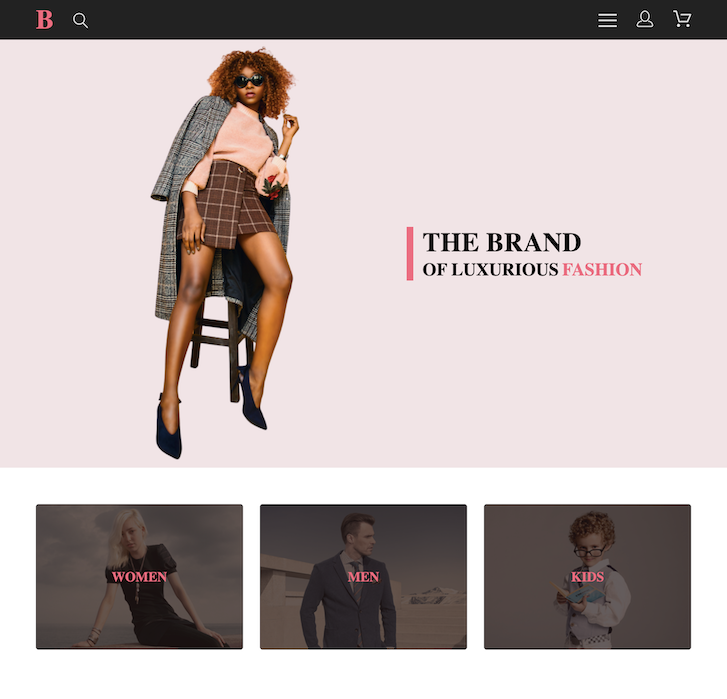

<h1 align="center">🛍️ Brand Shop</h1>

<div align="center">
  <p align="center">
    <a href="https://www.php.net/"></a>
    <a href="https://httpd.apache.org/"></a>
    <a href="https://www.mysql.com/"></a>
    <a href="https://developer.mozilla.org/en-US/docs/Web/JavaScript"></a>
    <a href="https://sass-lang.com/"></a>
    <a href="https://jestjs.io/"></a>
  </p>

  <a href="https://brandshop.fun">
    
  </a>

  <p>
    A full-stack eCommerce platform built as a study project during an internship at Taitotalo.
  </p>

  <p align="center">
    <a href="https://brandshop.fun">
      
    </a>
  </p>
  <a href="#description">Description</a> •
  <a href="#tech-stack">Tech Stack</a> •
  <a href="#features">Features</a> •
  <a href="#setup">Setup</a> •
  <a href="#testing">Testing</a> •
  <a href="#design">Design</a>
</div>

---

## Description

The Brand Shop is a responsive web application that allows users to browse and purchase fashion items online. It is built with a focus on clean architecture, user experience, and functionality. The system implements a clear separation of concerns using the MVC pattern.

## Tech Stack

- **PHP 8.0+** — Backend logic
- **Apache 2.4+** — Web server
- **MySQL 8.0+** — Relational database
- **JavaScript (ES6+)** — Frontend behavior
- **SCSS (SASS)** — Modular CSS styling
- **HTML5** — Semantic markup

## Features

- User registration & login
- Admin dashboard
- Product catalog with filtering
- Shopping cart and checkout
- Order tracking & history
- Mobile-friendly responsive design

## Setup

### Prerequisites

- PHP 8.0+
- Apache 2.4+
- MySQL 8.0+
- Composer

### Steps

1. Clone the repository:

   ```bash
   git clone <repository-url>
   cd brand-shop
   ```

2. Install PHP dependencies via Composer:

   ```bash
   composer install
   ```

3. Create a new MySQL database:

   ```bash
   mysql -u your_username -p
   CREATE DATABASE brand_shop CHARACTER SET utf8mb4 COLLATE utf8mb4_unicode_ci;
   exit
   ```

4. Import the SQL dump:

   ```bash
   mysql -u your_username -p brand_shop < data/brand_shop.sql
   ```

5. Update `config.php` with your database credentials:

   ```php
   define('DB_HOST', 'localhost');
   define('DB_NAME', 'brand_shop');
   define('DB_USER', 'your_user');
   define('DB_PASS', 'your_password');
   ```

6. Make sure Apache is running and the project is placed in your local server's root directory  
   (e.g., `htdocs` for XAMPP/MAMP or `/var/www/html` for system-wide Apache).

7. Visit the app in your browser:

   ```
   http://localhost/brand-shop/
   ```

## Demo Credentials

Use these credentials to explore the app:

- **User:** `user@email.com` / `r3YiHfjkniqMfTX`
- **Admin:** `admin@admin.com` / `dVYTRrT7tnkp8BP`

## Testing

This project uses [PHPUnit](https://phpunit.de/) for backend testing.

Run tests via Composer:

```bash
composer install
composer test
```

## Design

You can explore system structure and visual designs in the [project wiki](https://github.com/alexelkinx/brand-shop/wiki).

### Highlights

- **System Architecture** – Overview of backend components
- **Sitemap** – Navigation flow of the website
- **ERD** – Entity relationship diagram for the database
- **UI Layouts** – Page mockups (desktop & mobile)

<h4 align="center">Homepage Preview</h4>

<p align="center">
  
  <br />
  <em>Homepage design (see Wiki for more)</em>
</p>

For raw images and layouts, you can also explore the [design/](design/) folder.
